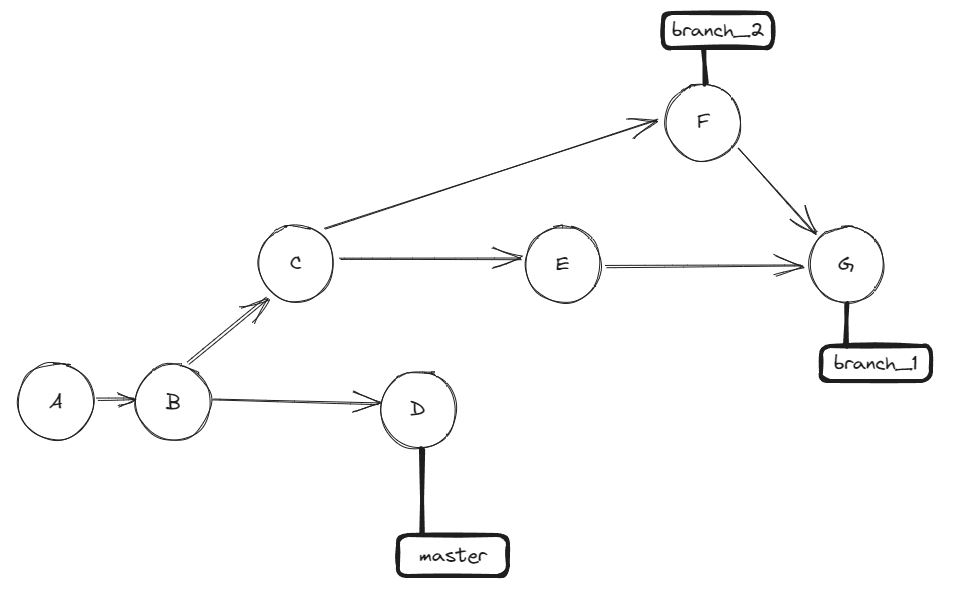
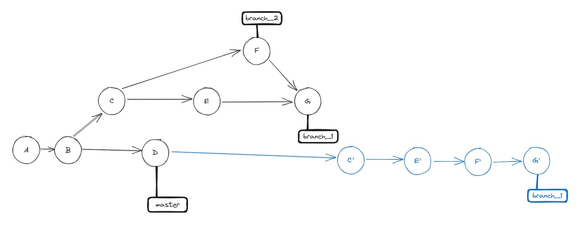

# The problem

Here is a git tree



The goal is to rebase the commits `branch_1` over `master` so C, E, F and G are added on master after D as in the following diagram



# The test cases

The test cases are created using the script `create_context.sh` working on a `main.txt` file.

main.txt look like :

```
REFERENCE LINE X001
REFERENCE LINE X002
REFERENCE LINE X003
REFERENCE LINE X004
REFERENCE LINE X005
REFERENCE LINE X006
REFERENCE LINE X007
REFERENCE LINE X008
REFERENCE LINE X009
REFERENCE LINE X010
REFERENCE LINE X011
REFERENCE LINE X012
REFERENCE LINE X013
REFERENCE LINE X014
REFERENCE LINE X015
REFERENCE LINE X016
REFERENCE LINE X017
REFERENCE LINE X018
REFERENCE LINE X019
REFERENCE LINE X020
```

Those lines are reference lines. Each commit will add a line between two different reference lines so the won't be conflicts (ex: "Commit A" will add a line between ref. line X001 and X002, while "Commit B" will add a line between ref. line X002 and X003 etc.)

Each test case can be examined looking at this repo.

## Test case 1

In test case 1 (branch names `testcase1/master`, `testcase1/branch_1`, `testcase1/branch_2`), the commits E and F don't conflicts *but* merge G add a line (which is not a good practice, it's to display the problem that will be more problematic in test case 2)

So after commit E `main.txt` look like :
```
REFERENCE LINE X001
COMMIT A
REFERENCE LINE X002
COMMIT B
REFERENCE LINE X003
COMMIT C
REFERENCE LINE X004
REFERENCE LINE X005
COMMIT E
REFERENCE LINE X006
REFERENCE LINE X007
REFERENCE LINE X008
REFERENCE LINE X009
REFERENCE LINE X010
REFERENCE LINE X011
REFERENCE LINE X012
REFERENCE LINE X013
REFERENCE LINE X014
REFERENCE LINE X015
REFERENCE LINE X016
REFERENCE LINE X017
REFERENCE LINE X018
REFERENCE LINE X019
REFERENCE LINE X020
```

After commit F `main.txt` look like :
```
REFERENCE LINE X001
COMMIT A
REFERENCE LINE X002
COMMIT B
REFERENCE LINE X003
COMMIT C
REFERENCE LINE X004
REFERENCE LINE X005
REFERENCE LINE X006
COMMIT F
REFERENCE LINE X007
REFERENCE LINE X008
REFERENCE LINE X009
REFERENCE LINE X010
REFERENCE LINE X011
REFERENCE LINE X012
REFERENCE LINE X013
REFERENCE LINE X014
REFERENCE LINE X015
REFERENCE LINE X016
REFERENCE LINE X017
REFERENCE LINE X018
REFERENCE LINE X019
REFERENCE LINE X020
```

And the merge G look like this:
```
REFERENCE LINE X001
COMMIT A
REFERENCE LINE X002
COMMIT B
REFERENCE LINE X003
COMMIT C
REFERENCE LINE X004
REFERENCE LINE X005
COMMIT E
REFERENCE LINE X006
COMMIT F
REFERENCE LINE X007
COMMIT G
REFERENCE LINE X008
REFERENCE LINE X009
REFERENCE LINE X010
REFERENCE LINE X011
REFERENCE LINE X012
REFERENCE LINE X013
REFERENCE LINE X014
REFERENCE LINE X015
REFERENCE LINE X016
REFERENCE LINE X017
REFERENCE LINE X018
REFERENCE LINE X019
REFERENCE LINE X020
```

### The rebase

The rebase look like this:

```
git checkout testcase1/branch_1
git rebase testcase1/master
```

After the rebase, the line intoduced by the commit G has disapeared.

only commit C', E' and F' are present.

It's possible to add `-r` to "keep merges", but it only keeps the topology of the merges, not the merge content.

You can say that a non conflicting commit should not change files, and I agree, it's just to show how rebase is working when there are no conflict on merge G.

Now let look at testcase2 when there are conflicts in merge G

## Test case 2

In test case 2 (branch names `testcase2/master`, `testcase2/branch_1`, `testcase2/branch_2`), the commits E and F conflicts.
* Commit E add a line in the "E" position *and* in the "G" position
* Commit F add a line in the "F" position *and* in the "G" position

merge G solve the conflict by keeping the non conflicting lines in the "E" and "F" positions, but replacing the lines in the "E" and "F" positions by a "G"

So after commit E `main.txt` look like :
```
REFERENCE LINE X001
COMMIT A
REFERENCE LINE X002
COMMIT B
REFERENCE LINE X003
COMMIT C
REFERENCE LINE X004
REFERENCE LINE X005
COMMIT E
REFERENCE LINE X006
REFERENCE LINE X007
COMMIT E
REFERENCE LINE X008
REFERENCE LINE X009
REFERENCE LINE X010
REFERENCE LINE X011
REFERENCE LINE X012
REFERENCE LINE X013
REFERENCE LINE X014
REFERENCE LINE X015
REFERENCE LINE X016
REFERENCE LINE X017
REFERENCE LINE X018
REFERENCE LINE X019
REFERENCE LINE X020
```

After commit F `main.txt` look like :
```
REFERENCE LINE X001
COMMIT A
REFERENCE LINE X002
COMMIT B
REFERENCE LINE X003
COMMIT C
REFERENCE LINE X004
REFERENCE LINE X005
REFERENCE LINE X006
COMMIT F
REFERENCE LINE X007
COMMIT F
REFERENCE LINE X008
REFERENCE LINE X009
REFERENCE LINE X010
REFERENCE LINE X011
REFERENCE LINE X012
REFERENCE LINE X013
REFERENCE LINE X014
REFERENCE LINE X015
REFERENCE LINE X016
REFERENCE LINE X017
REFERENCE LINE X018
REFERENCE LINE X019
REFERENCE LINE X020
```

And the merge G look like this:
```
REFERENCE LINE X001
COMMIT A
REFERENCE LINE X002
COMMIT B
REFERENCE LINE X003
COMMIT C
REFERENCE LINE X004
REFERENCE LINE X005
COMMIT E
REFERENCE LINE X006
COMMIT F
REFERENCE LINE X007
COMMIT G
REFERENCE LINE X008
REFERENCE LINE X009
REFERENCE LINE X010
REFERENCE LINE X011
REFERENCE LINE X012
REFERENCE LINE X013
REFERENCE LINE X014
REFERENCE LINE X015
REFERENCE LINE X016
REFERENCE LINE X017
REFERENCE LINE X018
REFERENCE LINE X019
REFERENCE LINE X020
```

### The rebase

The rebase look like this:

```
git checkout testcase2/branch_1
git rebase testcase2/master
```

The rebase re pop the conflict when rebasing F, so all the stuff done during solving the conflict of G should be done again, while none of the commit C, E, F or G is really conflicting on the node D.

It's possible to add `-r` to "keep merges", but it only keeps the topology of the merges, not the merge content.

### Question

Does `git` provides a way to rebase a branch that contains a merge, without having to do the potentially complex merge that has already happended in the branch ?
